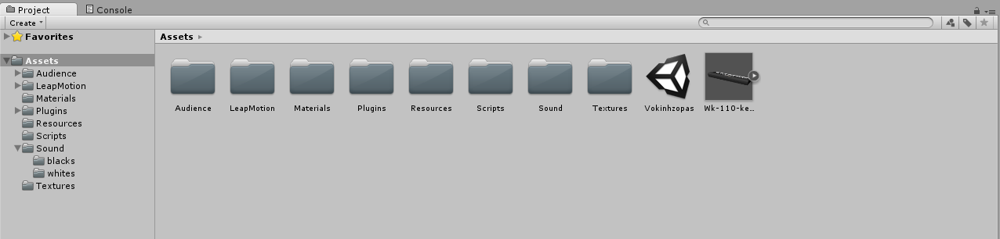

Vokinhzopas - A Leap Motion Piano
============

-----------------

-----------------

#### Advisor:   
	Prof. Miri Ben-Chen
#### Creators
	Katya Sapozhnikov
	Ziv Shahaf

-----------------

### Table of contents
[TOC]

-----------------

Introduction
-------------
The Leap Motion controller is a small USB peripheral device which is designed to be placed on a physical desktop, facing upward. Using two monochromatic IR cameras and three infrared LEDs, the device observes a roughly hemispherical area, to a distance of about 1 meter (3 feet). The LEDs generate a 3D pattern of dots of IR light and the cameras generate almost 300 frames per second of reflected data, which is then sent through a USB cable to the host computer, where it is analyzed by the Leap Motion controller software using "complex maths" in a way that has not been disclosed by the company, in some way synthesizing 3D position data by comparing the 2D frames generated by the two cameras.

The smaller observation area and higher resolution of the device differentiates the product from the Kinect, which is more suitable for whole-body tracking in a space the size of a living room. In a demonstration to CNET, The Leap was shown to perform tasks such as navigating a website, using pinch-to-zoom gestures on maps, high-precision drawing, and manipulating complex 3D data visualizations.

Unity is a cross-platform game creation system developed by Unity Technologies, including a game engine and integrated development environment (IDE). It is used to develop video games for web sites, desktop platforms, consoles, and mobile devices.
Unity allows specification of texture compression and resolution settings for each platform the game supports, and provides support for bump mapping, reflection mapping, parallax mapping, screen space ambient occlusion (SSAO), dynamic shadows using shadow maps, render-to-texture and full-screen post-processing effects. Unity's graphics engine's platform diversity can provide a shader with multiple variants and a declarative fallback specification, allowing Unity to detect the best variant for the current video hardware; and if none are compatible, fall back to an alternative shader that may sacrifice features for performance.
The game engine's scripting is built on Mono, the open-source implementation of the .NET Framework. Programmers can use UnityScript (a custom language with ECMAScript-inspired syntax, referred to as JavaScript by the software), C#, or Boo.

-----------------

Overview
-------------
Vokinhzopas (Katya’s last name spelled backwards) is a new way of practicing your piano skills on a virtual piano.
Using Leap Motion technology and Unity’s game engine we’ve developed a virtual world in which you can use your hands and fingers to play the piano.
The Leap Motion Controller senses how you naturally move your hands and lets you use your computer in a whole new way. It senses almost every little move of hands and fingers.
With the Leap Motion camera and our carful calibration we manage to provide an easy and fun user experience.

-----------------

Application Requirements
-------------
In order to use the app you must have the following:

- A Leap Motion Camera ([buy here](http://store-world.leapmotion.com/))
- Leap Motion driver ([Download here](https://www.leapmotion.com/setup))
- Windows 7 or 8
- A reasonable PC:
- AMD PhenomTM II or Intel® CoreTM i3 / i5 / i7 Processor
- 2 GB RAM
- USB 2.0 port
- The better the Graphical card is the better the quality & performance will be
- At least 1 human hand.

-----------------

Project Infrastructure & Design
-------------
### Unity Environment
We used Unity’s game engine to create a virtual world in which we could use Leap Motion’s Hand Controller.
The application in Unity is saved as a scene.
Unity’s IDE holds a hierarchy of game objects (as called by Unity’s lingo) for every scene, in our application we have the following:

The scene also contians all the assests of the project which consists of every resource the application\editor\scence uses. Our project contains the following assets which are mostly self explantory: 

##### [Game object] Hand Controller
This is a global prefab^1 that represents all modules of the Leap Motion. The HandController consists of a rigid body, a box collider and is subject to physics and the HandController.cs script. 
The hand controller has a Robot Hands texture to give it a nice look and feel.
The HandController is actually the Interaction box of the Leap Motion Controller (camera).
The Interaction Box is the area in which the user can controll the HandController using the Leap Motion camera. This is what it looks like:
 
 
##### [Game object] Camera
There is only 1 (Main) Camera in the scene. It is located above the piano, looking at the keys, audience and planes, and is rotated in a way to provide a convenient view of the hands while playing.
##### [Game object] Audience
The audience are a group of prefabs, downloaded from the asset store and are subject to the audience.cs script, which helps in their animation.
##### [Game object] Lights
We have 2 directional lights in the scene, one at each side of the piano to give a nice and clear look to the scene along with a soft shadow of the keys and hands.
##### [Game object] Keyboard – Black and white keys
The keyboard is a 3D model downloaded from [here (at Google’s 3DWarehouse)](https://3dwarehouse.sketchup.com/model.html?id=f858955bcd01c82aabbc032d2bc8593) in a Google SketchUp format, imported into Unity with the help of [this YouTube tutorial](https://www.youtube.com/watch?v=vGkdNlpYgzs), and stripped down to contain only the black & white keys which are simply a set of meshes.
Each key in the piano model was assigned with a rigid body and a box collider to help us detect collisions between the HandController and the keys.
The keys are subject to the InterpolateKeys.cs script which does most of the work related to playing the piano, the looks of it and interaction with the piano using either the mouse or human hands.
To complete the piano playing experience we have downloaded piano notes sounds and assigned each keys with its individual sounds.

##### [ASSET] Scripts
All scripts are written in C# under the Unity namespace, mostly deriving from the MonoBehaviour class to allow the usage of the Update method and other related methods.
##### [Script] Audience.cs 
Using the script we randomly animate the audience to applause only while playing and rest when idle.
##### [Script] Main.cs
 Main controls the GUI layout of the application which allows the user to toggle mouse usage and to exit the application.
The script detects if the mouse is moving and when it is a GUI button appears to allow the user the choice of enabling or disabling the mouse. When the button is clicked the Icon changes and a V or X sign indicates whether the mouse can be used or not.
 
To exit the application the user should hit the Esc key and the “Quit?” GUI button [figure 2] will appear (and disappear on the next Esc key store).
 
##### [Script] Tools.cs 
Static class for auxiliary functions such as:
	Mapping Leap coordinates to world 3D coordinates
 
The Leap Motion Controller provides coordinates in units of real world millimeters within the Leap Motion frame of reference. The Leap Controller hardware itself is the center of this frame of reference (see leap axis in the picture above).
Mapping coordinates is much like converting temperatures from Celsius to Fahrenheit where each axis is a scale corresponding start (freezing) and an end (boiling) points.
Shift view when hands out of camera border to allow playing the entire keyboard. 
Since the keys and hand controller have to be big enough to be seen clearly by the user only 2 octaves can be comfortably played using your hands.
In order to allow playing the entire piano we have added two option that make the camera and hands move alongside the piano:

- Using right\Left arrow keys
- Shifting one of your hands to the farthest side of the screen while keeping it inside Leap’s Interaction box and holding it there, this will gradually move everything needed to allow you to play the rest of the keys comfortably.
##### [Script] InterpolateKeys.cs 
This is the main engine of our project. It detects hand collision with the keys, interpolates key’s movement and color and plays a sound while the key is down.
The overall algorithm of this script is that every frame we update the key to the right position, rotation, color and sound.
Each and every key is assigned to act according to this script, so we wrote it while remembering in the back of our minds that it can be any key, in any color, any position, any rotation and in general in any state.
A collision event is triggered when the hand controller model collides with key model. This was achievable thanks to Unity’s physics engine when we add properties of a rigid body and a box collider for object in the scene. We set those properties for every key and for the hands.
We constantly update start and target vectors to interpolate key’s position and rotation to provide smooth movement. Same is done with color interpolation. Since the keys in the keyboard touch one another (due to the way the model was built) the script detects which collision occurred and only acts when the hand touches the key. 
The movement interpolation is calculated with quaternions functions lerp and slerp.
Since the hands can pass through the keys multiple collisions can happen so the script makes sure only 1 collision every ~100 ms affects the keys (this is why while playing using the mouse you can’t click the same key twice very quickly).
##### [Script] HandController.cs
This script was provided by leap motion.
We used this script to track hand positions to check where we need to move our hands and camera to get to farther keys.
The hand model is set of several sub-models:
##### FingerModel 
If all or part of a finger is not visible, the finger characteristics are estimated based on recent observations and the anatomical model of the hand. A Finger object provides a Bone object describing the position and orientation of each anatomical finger bone. All fingers contain four bones ordered from base to tip. 
  
##### HandModel
The hand model provides information about the identity, position, and other characteristics of a detected hand, the arm to which the hand is attached, and lists of the fingers associated with the hand.
The hand is set from palm and fingers, each has it own bone structure.
We tracked palm position in our application to detect whether palm is outside piano borders.
Main functions:

- CreateHand – Crates a new hand instance and sets its position.
- UpdateHandModels – Updates hand positions. Here we set right most hand position and left most hand position. Those parameters help us decide if we need to move over the keyboard.

### Project difficulties 

##### Going through keys
At first we had the problem that hands are going through the keys and we god two collisions with a key, so the sound was played twice. To deal with this issue we created a plane that is height was exactly under the keyboard, this won’t allow the hand go lower than the plane. Also we added a time threshold that defines we can collide with a key once every 100ms.
##### Collision of keys with other keys
Because all object had rigid body and box collider, each key collides with the neighbor keys. This caused problems because we had sound and color changing constantly. We had to check each collision event what is the object we are colliding with. That was an issue because we have no way to determine with model is it. What we did is to put all keys under the same parent model. When collision event is triggered we compared with the parent model name to ignore those events.
##### Creating the piano model
We downloaded the piano model. The model wasn’t set correctly. Each key’s center in model space was translated so it was hard to work with unity’s built in parameters position and localposition. What we did was to check manually how the delta vector to the target position and hard code it.
##### Interpolation of keys and their color
It took us a while to find the right function to interpolate with. We ended up working with quaternions lerp and slerp functions. We had to find:

 - Parameterization that gives us the most realistic piano movement
 - Keyboard angle that is comfortable to play with when the hands are over the camera 
 - Hands position that allows hand to lean on the table so player won’t have to place hands in the air the entire time.
 - Adding correct sounds
 - All the sound kits of piano notes we found didn’t include all octaves we had on our piano.
 - We had to record each sound and edit its duration so all sounds will be the same.

##### Finding leap's boundaries
We had to find leap borders so the player could move the hands over the piano when playing to reach farther keys. To do so we converted Leap coordinates that we received from leap bounding box to 3D world coordinates.

##### Shifting piano when hands move
As we mentioned before our piano model was problematic because center of key weren’t at the center. This problem, didn’t allow us to move the piano correctly over the scene. We decided to move hands and camera instead the keyboard itself to reach farther keys. 

### Known Issues
While mouse is enabled, and playing the piano using the hand controller, if the hands move quickly away from the piano, keys might get stuck down. Disabling the mouse and moving hands away from the camera restores the keys.
